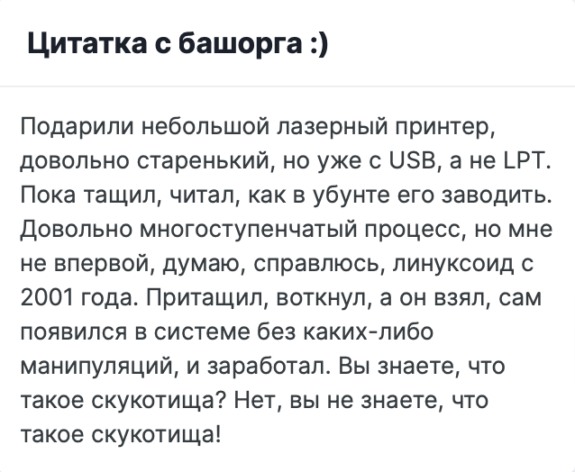

# [Bash.org.ru](https://башорг.рф) plugin for Invision Power Suite

The plugin displayes a widget with a random funny quote from bash.org.ru (now башорг.рф). Click on the widget to show the next quote. Quotes are downloaded from bash.org.ru every 6 hours by cron and retrieved from cache.

Originally developed for https://ulanovka.ru in 2008 for phpBB 2 and rewritten to IPS in 2014.

## Installation

Install by manual uploading of the `Bash.org 1.0.1.xml` file in the ACP.

## Screenshots

З.Ы. Кодед бай Мак и ниипет)
